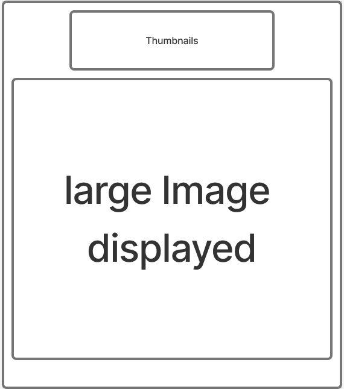

Relfection Required

    🎯 What requirements did you achieve?
    🎯 Were there any requirements or goals that you were unable to achieve?
    🎯 If so, what was it that you found difficult about these tasks?

for this project i had to create a image gallery using react js in order to do this i first drafted up my wireframe to inform what i wanted to page to look like based off of the exapmple site shown this wireframe also served as my guide when i went to actually making the page as I could see which aspects of the site would be their own components.

for this I decided that the large image display would be its own component and the thumbnail would be it's own as well taking this approach made the proscess of building the pagee much more manageable as I only had to deal with one compenent at a time and then assmeble them in the app.jsx .

As this has been somthing I have missed in previous projects this time and due to the requirements I ensured that I included some keyboard navigation and a use of the enter or space bar keys to interact with the thumbnails.

one thing that was an initail issue for me was that when I coded each component I ended up coding them all to work individually and struggled getting them to work as intended. It wasnt until I realised this and then I went back and had to start form scratch in a manner that worked this was done by rasing the state to the App.jsx and then passing it down to each of the components as I had initially coded the states into each component which presented issues when I tested the page.

once this issue was solved the gallery worked fine and so I moved onto styling and wanted to try useing tailwind, However I also ran into some errors with this which caused the page to break. the error was that when I implemented tailwind.css I had imported it wrong which broke the page however I had fixed it quickly after I saw my error.
the error was that I used @import "tailwindcss/vite" instead of @import "tailwindcss" this was found after I checked the tailwindcss documentation.

through out this projecct I found myself relying a lot on the documentation for both react and tailwind and also referring back to the demos and workshops through out thsi week. while the task was daunting using react and the api for the gallery as opposed to hard coding them after I watched a few tutorials on youtube to see how others approached it and as a guide I feel that I have met the requirements of this project and I fully intend to keep up with the use of react as it made the project much more managable for me.

# Resources used

Wireframe 

https://vite.dev/guide/env-and-mode

https://tailwindcss.com/docs/installation/using-vite

https://developer.mozilla.org/en-US/docs/Web/API/Element/keydown_event

https://www.w3schools.com/jsref/event_onkeydown.asp

https://www.youtube.com/watch?v=Vc6SFpPf-V4

https://www.youtube.com/watch?v=fbxAdwWUEc4
